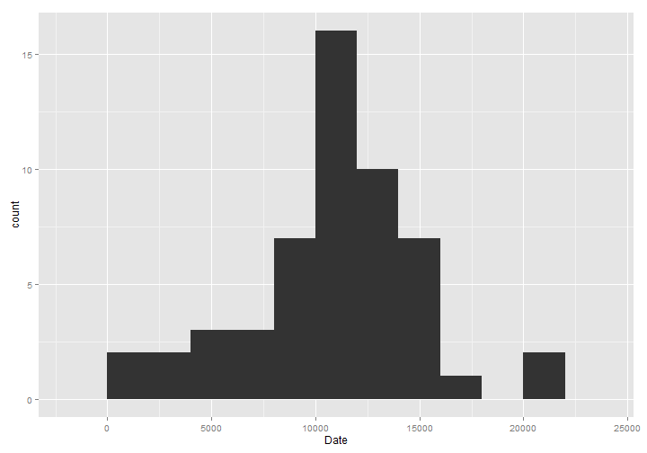
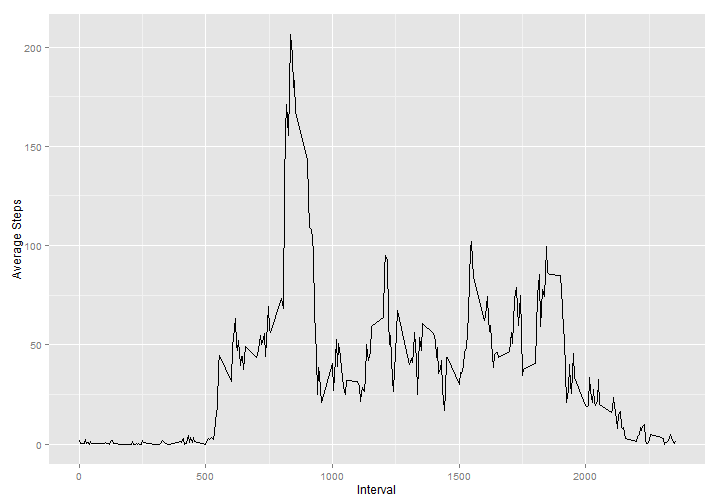
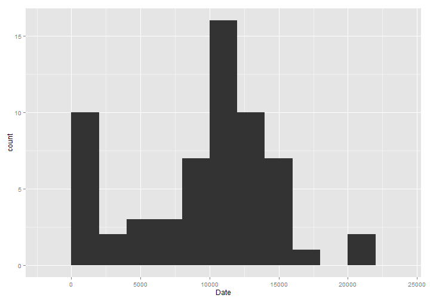
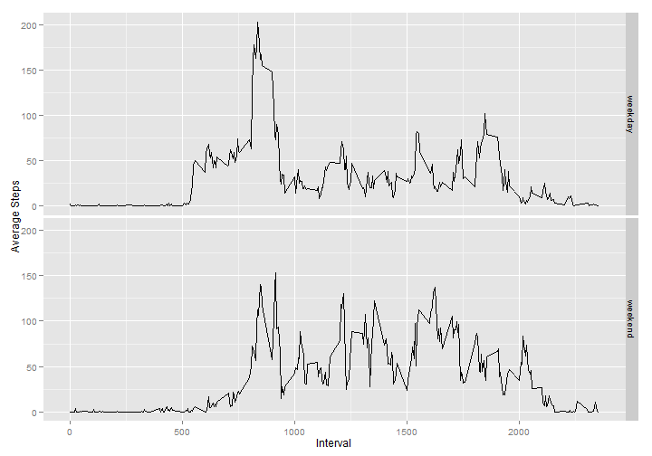

Reproducible Research: Peer Assessment 1
========================================


## Loading and preprocessing the data

```r
    dataFile <- unzip( 'activity.zip' )
    activity <- read.csv( dataFile, colClasses= c( 'numeric', 'Date', 'numeric') )
```


## What is mean total number of steps taken per day?

### Group the steps by day:

```r
    stepsPerDay <- aggregate( steps ~ date, data= activity, FUN= sum)
```

### A basic analysis of steps grouped by day:

```r
    library( ggplot2 )
    qplot( stepsPerDay$steps, xlab= 'Date', binwidth= 2000 )
```

 

```r
    meanSteps = mean( stepsPerDay$steps)
    medianSteps = median( stepsPerDay$steps )
```
- Mean: 1.0766 &times; 10<sup>4</sup>
- Median: 1.0765 &times; 10<sup>4</sup>


## What is the average daily activity pattern?

```r
    aveStepsPerInterval <- aggregate( steps ~ interval, 
                                      data= activity, 
                                      FUN= mean)

    qplot( aveStepsPerInterval$interval, aveStepsPerInterval$steps, 
           data= aveStepsPerInterval, 
           geom= 'line', 
           xlab= 'Interval', 
           ylab= 'Average Steps')
```

 

```r
    maxInterval = aveStepsPerInterval[ which.max( aveStepsPerInterval$steps ),]$interval
```
- The interval with the maximum number of steps is 835.


## Imputing missing values

```r
    naRows <- which( is.na( activity) )
    naCount <- length( naRows )
```

There are 2304 rows that contain NA data.  Let's impute them by finding the mean between the previous non-NA value and the next non-NA value and create a new data frame.


```r
activityCount <- nrow( activity )
impActivity <- activity

## Initialize nextSteps in case the dataset starts with a series of NA
## values for steps.
nextSteps <- NA

for ( i in 1:naCount ) {
    row <- naRows[i]
    
    ## If the first row in the dataset is NA, set previousSteps to 0.
    ## Otherwise, set previousSteps to the steps of the previous row
    ## in the activity data frame.
    if ( row == 1 ) {
        previousSteps <- 0
    } else {
        previousSteps <- impActivity[row - 1,]$steps 
    }

    ## If the last row in the dataset is NA, set nextSteps to previousSteps.
    ## Otherwise, if the rownumber of the current row is not sequential with
    ## the rownumber of the next row in naRows, set nextSteps to the number
    ## of steps in the next row of impActivity.  This prevents repetition
    ## when finding the next non-NA row in the next step.
    if ( row == activityCount ) {
        nextSteps <- previousSteps
    } else {
        nextRow <- naRows[i + 1]
        if ( nextRow - row != 1 ) {
            nextSteps <- impActivity[row + 1,]$steps
        }
    }
    
    ## While nextSteps is NA, read ahead in the impActivity data frame to
    ## find the next non-NA step value.
    counter <- 1
    while( is.na( nextSteps ) == TRUE ) {
        ## If the loop is at the end of the dataset, set nextSteps to
        ## previous steps.
        if ( row + counter >= activityCount ){
            nextSteps <- previousSteps
        } else {
            nextSteps <- impActivity[row + counter,]$steps
            counter <- counter + 1
        }
    }
    
    ## Change this row's step value from NA to the mean of the step values
    ## of the previous step and the next non-NA step.
    impActivity[row, ]$steps <- mean( c(previousSteps, nextSteps) )
}
```

### Group the steps by day for the imputed data set:

```r
    impStepsPerDay <- aggregate( steps ~ date, data= impActivity, FUN= sum)
```

### A basic analysis of steps grouped by day with imputed steps:

```r
    library( ggplot2 )
    qplot( impStepsPerDay$steps, xlab= 'Date', binwidth= 2000 )
```

 

```r
    meanImpSteps = mean( impStepsPerDay$steps)
    medianImpSteps = median( impStepsPerDay$steps )
```
- Mean: 9354.2295
- Median: 1.0395 &times; 10<sup>4</sup>

The all of the NA values were set to 0 which lowers the estimates calculated in the first part of the assignment.  The daily number of steps remains the same.


## Are there differences in activity patterns between weekdays and weekends?

### Create a new factor variable in the imputed dataset with the levels "weekday" and "weekend".


```r
## A function to determine if a given day occurs in the weekend or work week.
findDayType <- function( date ) {
    if ( weekdays( date ) %in% c('Sunday', 'Saturday') ) { 
        dayType <- 'weekend' 
    } else { 
        dayType <- 'weekday' 
    }
    
    dayType
}

## Add the factor dayType using the findDayType function.
impActivity$dayType <- as.factor( sapply( impActivity$date, findDayType) )
```

### Compare the average number of steps per five minute intervals of weekdays and weekend days.


```r
    aveStepsPerInterval <- aggregate( steps ~ interval + dayType, 
                                      data= impActivity, 
                                      FUN= mean)

    qplot( aveStepsPerInterval$interval, 
           aveStepsPerInterval$steps, 
           data= aveStepsPerInterval,
           facets= dayType ~ .,
           geom= 'line', 
           xlab= 'Interval', 
           ylab= 'Average Steps')
```

 
